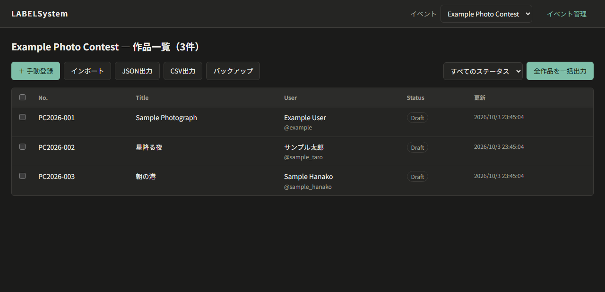
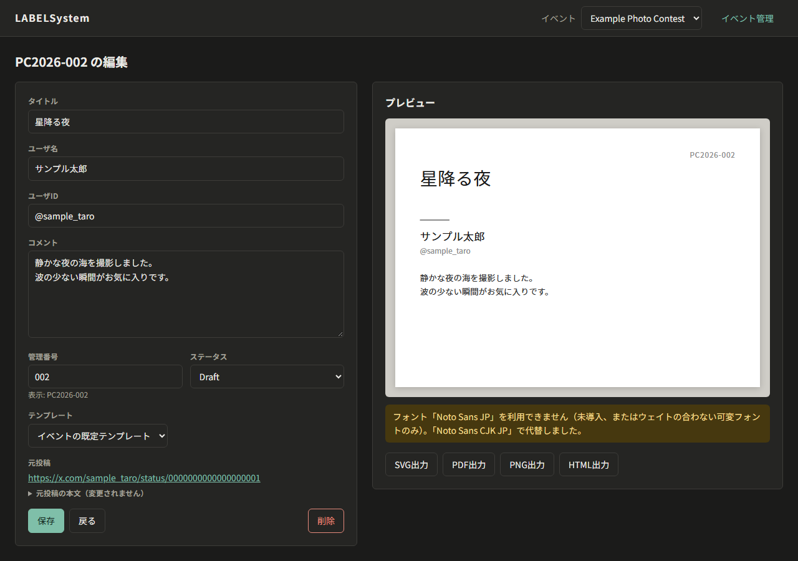

# LABELSystem

**Layout and Artwork Bibliographic Entry Layer** — フォトコンテスト用キャプション生成システム

X（旧Twitter）上のフォトコンテスト応募投稿から **タイトル・ユーザ名・ユーザID・コメント** を取り込み、
美術館・写真展の作品キャプションを想定したテンプレートへ流し込んで、
**SVG / PDF / PNG / HTML** として出力します（VRChatワールドでの展示・印刷の両方を想定）。

- Xから取れる情報はブラウザ拡張で取得し、タイトルなど取れない情報は人が入力・修正します。
- Xを使えない場合でも、**手入力・CSV・JSON** から作品を登録して運用を続けられます。
- Google スプレッドシートの内容を、GAS連携で自動的に取り込めます。
- 絵文字や機種依存文字も、SVG / PDF / PNG で同じ見た目に出力します。
- 画像認識・自動収集・AIによる文章生成は行いません。




（画面はすべて架空のサンプルデータです）

## システム構成

```text
[X のページ] → [ブラウザ拡張] ─HTTP→ [ローカルサーバ] → [SQLite]
                                          │
                       [管理UI] ←────────┤
                                          └→ [テンプレート] → [レンダラー] → SVG / PDF / PNG / HTML
```

| ディレクトリ | 役割 |
| --- | --- |
| `apps/extension` | ブラウザ拡張（Manifest V3）。X投稿 → 構造化データへの変換のみ |
| `apps/server` | ローカルAPIサーバ（`http://127.0.0.1:38471`） |
| `apps/admin-web` | 管理UI（一覧・編集・プレビュー・出力） |
| `packages/core` | X非依存の基幹ロジック（解析・CaptionModel・ファイル名・CSV/JSON） |
| `packages/x-extractor` | **XのDOMに依存する唯一の場所** |
| `packages/database` | Migration と Repository（SQLite） |
| `packages/template-engine` | テンプレートの読み込み・探索・変数置換 |
| `packages/renderer` | 自動改行・SVG / PDF / PNG / HTML 生成 |
| `templates/example` | 同梱サンプルテンプレート |
| `integrations/gas` | スプレッドシート連携用の Google Apps Script |
| `data/` | **運用データ（Git管理対象外）** |
| `output/` | 出力ファイル（Git管理対象外） |

詳しくは [docs/architecture.md](docs/architecture.md) を参照してください。

## 動作環境

- Node.js **22.13 以上**（標準の `node:sqlite` を使用。ネイティブモジュールのビルドは不要）
- ブラウザ: Google Chrome / Microsoft Edge / Brave などChromium系（Firefox 115以上でも動作する構成）
- 日本語フォント（下記「フォント」参照）

## インストールと起動

```sh
git clone https://github.com/ChikumaTateshina/LABELSystem.git
cd LABELSystem
npm install
npm start
```

初回起動時に `examples/config.example.json` から `data/config.json` が生成され、DBが作成されます。
ブラウザで <http://127.0.0.1:38471/> を開くと管理画面が表示されます。
イベント名や管理番号の接頭辞は `data/config.json`（初回のみ）または管理画面の「イベント管理」で設定します。

手順の詳細は [docs/setup.md](docs/setup.md)、日々の使い方は [docs/operation.md](docs/operation.md) にあります。

## ブラウザ拡張の導入

```sh
npm run build      # apps/extension/dist/ に出力
```

- **Chrome / Edge**: `chrome://extensions` →「デベロッパー モード」を有効化 →「パッケージ化されていない拡張機能を読み込む」→ `apps/extension/dist` を選択
- **Firefox**: `about:debugging#/runtime/this-firefox` →「一時的なアドオンを読み込む」→ `apps/extension/dist/manifest.json` を選択

使い方: Xで応募投稿の**詳細ページ**を開き、拡張機能のボタンを押すと登録確認画面が開きます。
内容を確認・修正して「登録」を押してください。同じ投稿は二重登録されません。

## 出力形式

| 形式 | 用途 |
| --- | --- |
| SVG | マスター出力。PDF・PNGはこのSVGから生成します |
| PDF | 印刷用。実寸・フォント埋め込み。全作品を1ファイルにまとめた `captions-all.pdf` も生成可能 |
| PNG | 共有・VRChatワールドのテクスチャ用（既定300dpi、`output.pngDpi` で変更） |
| HTML | CSSを内包した単一ファイル。文字がテキストとして残るため、Web掲載や再利用に向きます。`captions-all.html` も生成可能 |

ファイル名は `{管理番号}_{ユーザID}_{タイトル}.{拡張子}` です（例: `PC2026-042_example_星降る夜.pdf`）。

## テンプレートの追加

`data/templates/<任意の名前>/` に `template.svg` と `template.json`（HTML出力のデザインも指定する場合は
`template.html` / `template.css`）を置くと、管理画面から選択できるようになります。
書式は [docs/template-format.md](docs/template-format.md) を参照してください。

## フォント

テンプレートが指定するフォントは、利用者自身がPCへインストールしてください
（フォントファイルはこのリポジトリに含めていません）。
インストールせずに使う場合は `data/assets/fonts/` にフォントファイルを置きます。
サンプルテンプレートは [Noto Sans JP](https://fonts.google.com/noto/specimen/Noto+Sans+JP) を使用します。
指定フォントが無い場合は代替フォントで描画し、プレビューに警告を表示します。

> 可変フォント（Variable Font）版は既定ウェイトしか使えません。
> ウェイト別の静的フォント（`NotoSansJP-Regular.ttf` など）を導入してください。

### 絵文字・環境依存文字

テンプレートのフォントに無い文字（絵文字、機種依存文字、ハングルなど他言語の文字）は、
PCにある別のフォントから字形を探し、**輪郭（ベクター図形）としてSVGへ埋め込みます**。
そのため SVG / PDF / PNG のどれでも、どの環境で開いても同じ見た目になります。

- 絵文字は Windows の「Segoe UI Emoji」、または「Noto Emoji」の字形を使います（カラー絵文字に対応）。
- 肌の色・家族などの結合絵文字にも対応します。国旗は Windows のフォントに収録されていないため、「JP」のような文字になります。
- 絵文字の見た目はXの表示（Twemoji）とは異なります。
- macOS / Linux では、輪郭を持つ絵文字フォント（Noto Emoji など）を導入してください。
  Apple Color Emoji / Noto Color Emoji は画像形式のため使用できません。
- どのフォントにも無い文字は、プレビューに警告が表示されます。
- HTML出力では、閲覧するブラウザ・OSの絵文字で表示されます。

## データの保存場所とバックアップ

- DB: `data/database.sqlite` / 設定: `data/config.json` / 専用テンプレート: `data/templates/`
- **`data/` ディレクトリをコピーすれば全データを復元できます。**
- 管理画面の「バックアップ」で `data/backups/<日時>/` にDBのコピーと `entries.json` を保存します。
- 「JSON出力」「CSV出力」で作品データを書き出し、「インポート」で読み込めます。
- Google スプレッドシートから直接取り込む場合は [docs/gas.md](docs/gas.md) を参照してください。
- GitHubは本番データのバックアップ先ではありません。`data/` は `.gitignore` で除外されています。

年度別に分けたい場合は、環境変数 `LABEL_DATA_DIR` でデータの場所を切り替えるか、
管理画面で新しいイベントを作成します（[docs/succession.md](docs/succession.md)）。

## 既知の制限

- 拡張機能からの登録は投稿の**詳細ページ**でのみ行えます（タイムライン上での誤取得を防ぐため）。
- タイトルの自動抽出は「タイトル：○○」のような明示的な記述がある場合のみです。推測はしません。
- 国旗の絵文字など、PC内のどのフォントにも無い文字は表示できません（プレビューで警告されます）。
- HTML出力はブラウザが改行位置を決めるため、SVG / PDF / PNG と改行位置が一致しないことがあります。
  レイアウト破綻の検出はSVG側の計算に基づきます。
- 1台のPCで1人が使う前提です（複数端末・同時編集には未対応）。
- PDF/X への変換は行いません。必要な場合は外部ツールで後処理してください。

## X のページ構造が変わったとき

Xのページ構造は予告なく変わります。拡張機能で「投稿情報を取得できませんでした」と表示されるようになったら、
[docs/x-extractor.md](docs/x-extractor.md) に従って `packages/x-extractor/index.ts` **だけ**を修正してください。
修正までの間も、拡張機能の「手動入力」、管理画面の「手動登録」、CSV/JSONインポートで運用を続けられます。

## 開発者向け

```sh
npm test            # 自動テスト
npm run lint        # Lint
npm run typecheck   # 型チェック
npm run build       # ブラウザ拡張のビルド
npm run migrate     # DBスキーマを最新へ更新
```

- [docs/architecture.md](docs/architecture.md) — 全体構成と設計境界
- [docs/setup.md](docs/setup.md) — 環境構築
- [docs/operation.md](docs/operation.md) — 運用手順
- [docs/template-format.md](docs/template-format.md) — テンプレート書式
- [docs/gas.md](docs/gas.md) — Google スプレッドシート連携（GAS）
- [docs/database.md](docs/database.md) — DBスキーマとMigration
- [docs/x-extractor.md](docs/x-extractor.md) — X仕様変更時の保守ガイド
- [docs/succession.md](docs/succession.md) — 引継ぎ資料
- [docs/LABELSystem.md](docs/LABELSystem.md) — 要件・仕様書
- [CONTRIBUTING.md](CONTRIBUTING.md) / [SECURITY.md](SECURITY.md)

## ライセンス

[MIT License](LICENSE)。利用ライブラリのライセンスは [THIRD_PARTY_LICENSES.md](THIRD_PARTY_LICENSES.md) を参照してください。
